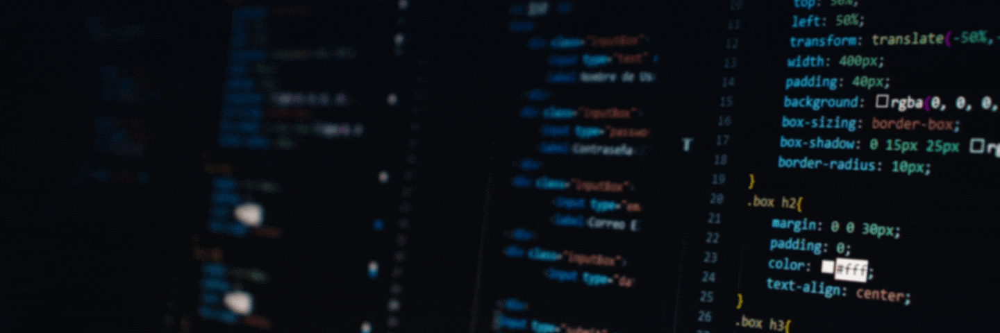

### Hey! :wave: I'm Emanuele Franceschini!
    

I'm a self taught Web Developer passionate about learning new technologies to  
bring amazing things into the world, with strong attention to details and design  
as well as performance and functionality.  
My goal is using my creativity to help as many people as possible, and here are  
the core skills that will help me do that:

##### :computer: Technologies: 

      

##### :black_nib: Design:

  

##### :gear: Control Version:

